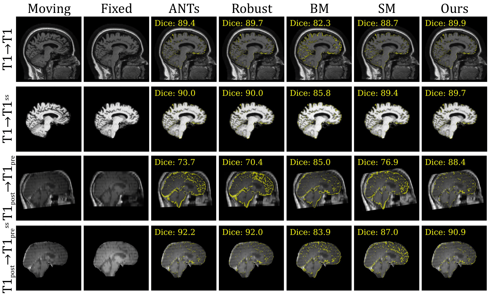

# LongR²: Longitudinal Rigid Registration for Brain MRI

<p align="center">
  
</p>

<p align="center"><em>Representative within-subject registration pairs. Each row shows a fixed image overlaid with the image moved by each method; we additionally overlay the absolute difference between fixed and moved brain masks in yellow. BrainMorph (BM) and SynthMorph (SM) use deep learning.</em></p>

This repository contains the source code for the research paper "*Learning Accurate Rigid Registration for Longitudinal Brain MRI from Synthetic Data*". You can find the paper [here](https://ieeexplore.ieee.org/document/10980859). ([arXiv](https://arxiv.org/abs/2501.13010), [PMC](https://pmc.ncbi.nlm.nih.gov/articles/PMC12237398/))

---

## Overview
We provide here a deep learning–based **rigid** registration tool specifically optimized for **longitudinal (within-subject) brain MRIs**. The method is trained using **synthetic longitudinal image pairs**, enabling accurate and robust estimation of rigid transformations across timepoints. The training strategy follows principles of synthetic-data–driven learning (see this [paper](https://direct.mit.edu/imag/article/doi/10.1162/imag_a_00337/124867/Synthetic-data-in-generalizable-learning-based) for background). 

The model is trained in an [anatomy-aware and acquisition-agnostic](https://arxiv.org/abs/2301.11329) manner, allowing it to generalize across different MRI contrasts and to operate reliably **with or without skull stripping**.

---

## Table of Contents
- [Instructions](#instructions)
- [Citation](#citation)
- [Acknowledgements](#acknowledgements)

---

## Instructions

### Getting Started

This project can be run either (A) containerized with Apptainer/Singularity (recommended for reproducibility) or (B) in a local Python environment. Pick one of the two flows below.

Prerequisite: clone the repository including submodules:

```bash
# Recommended (single-step, HTTPS)
git clone --recurse-submodules https://github.com/Fjr9516/longitudinal-rigid-registration.git
cd longitudinal-rigid-registration

# If already cloned:
git submodule update --init --recursive

# To update submodules to their tracked remote branches:
git submodule update --init --recursive --remote
```

A) Container (Apptainer / Singularity) — recommended

- Install `apptainer` or `singularity` on your system (see https://apptainer.org).
- Create a `containers/` directory and build or download the SIF image used for experiments:

```bash
mkdir -p containers
apptainer build containers/tensorflow_2.14.0-gpu.sif docker://tensorflow/tensorflow:2.14.0-gpu
```

- The repository includes a helper script `./setup/run_in_apptainer.sh` that wraps running commands inside the SIF. Example usage:

```bash
# Run training inside the container
./setup/run_in_apptainer.sh python -m modules.train

# Run evaluation inside the container
./setup/run_in_apptainer.sh python -m modules.eval
```

- If your SIF file is stored at a different path, either move it into `containers/` with the name above, or edit `./setup/run_in_apptainer.sh` to point to your file.

B) Local Python environment

- Create and activate a conda environment (example):

```bash
conda create -n longr2 python=3.11 -y
conda activate longr2
```

- Install Python dependencies from a development requirements file:

```bash
pip install -r requirements.txt
```

- Run the same entry points locally instead of using the container:

```bash
python -m modules.train
python -m modules.eval
```

### Training (overview)

All training and evaluation behavior is controlled by a YAML configuration file. See and edit [configs/config.yaml](configs/config.yaml) — it contains examples for `train`, `eval`, `model`, and `synthesis` settings used by the entry points.

Pretrained weights and example evaluation CSVs are available from the project [release](https://github.com/Fjr9516/longitudinal-rigid-registration/releases/tag/v1.0.0). Place downloaded weights (e.g. `.h5`) under `models/rigid_reg/` and example CSVs under `data/eval/` (or update paths in your config).

Quick training checklist:

- Edit `configs/config.yaml` and set the `train` section (dataset paths, epochs, learning rate, etc.).
- Ensure required data files referenced in the config are present (e.g., `train.data` in the config).
- Run training (containerized recommended):

```bash
./setup/run_in_apptainer.sh python -m modules.train
```

By default the training will read `configs/config.yaml`; edit that file or replace it with your own configuration file before launching training.

Monitoring and outputs:

- Training logs are written to `logs/`.
- Model checkpoints are saved under `models/rigid_reg` (see `train.save_name` in the config).

### Reference / Evaluation

1. **Prepare config**
    - Edit `configs/config.yaml` and set the `eval` section fields: `data` (CSV(s)), `weights` (path template), `run_name`, `labels` (LUT), `save_name`, and optional `out_fig` to save moved images and transform lta files.

2. **Run evaluation**
    - From the repository root run (containerized):

      ```bash
      ./setup/run_in_apptainer.sh python -m modules.eval
      ```

3. **Outputs**
    - Results CSV is written as `eval.save_name` in the config.
    - If `eval.out_fig` is set, moved images and transform lta files are saved in that directory.

  **Freesurfer users:** you can apply a saved `.lta` transform to a moving volume with `mri_convert`. Example:

  ```bash
  mri_convert /path/to/moving.mgz \
    -at /path/to/transform.lta \
    /path/to/out_moved.nii.gz \
    -rt cubic
  ```

  Use `-rt nearest` when saving label maps (to preserve integer labels).

4. **Benchmark**
  - Performance note: on a Quadro RTX 6000, with input volumes of size 256×256×256, a single registration takes approximately ~2 seconds (measured end-to-end for model inference and resampling).

## Citation
If you use LongR² in your work, please cite the following paper:
```bibtex
@inproceedings{fu2025longitudinalrigid,
  author    = {Fu, Jingru and Dalca, Adrian V. and Fischl, Bruce and Moreno, Rodrigo and Hoffmann, Malte},
  title     = {Learning Accurate Rigid Registration for Longitudinal Brain MRI from Synthetic Data},
  booktitle = {2025 IEEE 22nd International Symposium on Biomedical Imaging (ISBI)},
  year      = {2025},
  pages     = {1--5},
  address   = {Houston, TX, USA},
  doi       = {10.1109/ISBI60581.2025.10980859},
  keywords  = {Training, Neuroimaging, Deep learning, Image registration, Accuracy,
               Magnetic resonance imaging, Transforms, Brain modeling, Synthetic data,
               Rigid image registration, Longitudinal analysis}
}
```

## Acknowledgements:
This repository builds upon ideas and tools from [SynthMorph](https://martinos.org/malte/synthmorph/).


